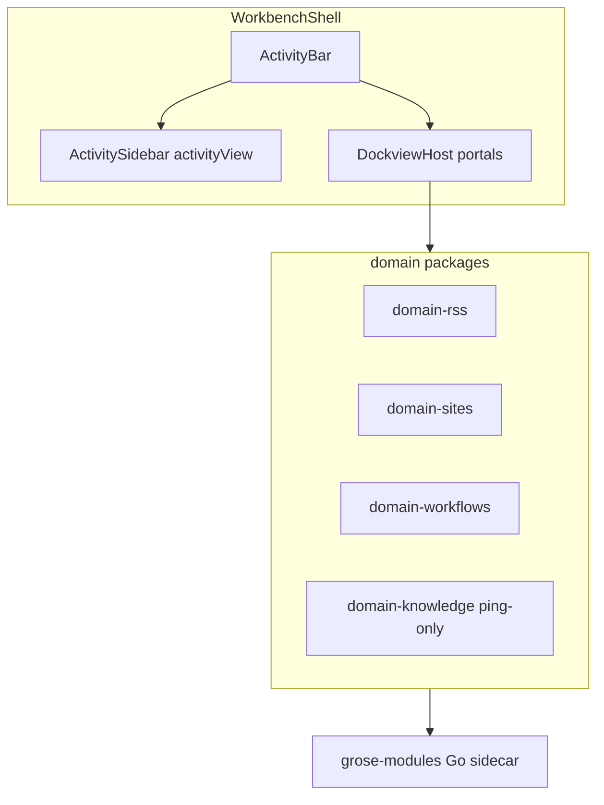

# 项目全面分析：优化、重构与功能缺口

## 现状一句话

Electron 已切到 **Workbench 唯一壳**（[docs/refactor-remove-app-shell.md](docs/refactor-remove-app-shell.md) Phase 0–5 已执行；[`workbench/feature.ts`](apps/electron/src/renderer/workbench/feature.ts) 恒为 `true`）。产品重心应从「换壳」转到 **模块补齐 + 壳层债清理 + sidecar 能力收敛**。

---

## 模块成熟度（按优先级看）

| 等级 | 模块 | 说明 |
|------|------|------|
| 可用 | Sources / Skills / Settings / Connectors | 列表 + 详情模式成熟 |
| 半成品 | Agents | Chat/Files 实；**Changes / Terminal 占位**；Session 列表比经典 SessionList 薄（无筛选/多选/菜单） |
| 半成品 | Sites | Chat/Files/Browser/Data/Plan 实；**Changes / Terminal / VS Code 占位** |
| 半成品 | Automations + Workflows | Rules 活；Flows 画布有；**非 agent 节点多为 stub**；schedule/webhook runner 未真正开火 |
| 半成品 | Tables | 浏览/预览；**格子只读，无 Admin DML** |
| 半成品→可用 | RSS | 已接 sidecar；docs 仍写 mock；`mock/` 目录已死；旧布局可能残留 Feeds dock 列 |
| 空壳 | Knowledge | UI 全 Placeholder；RPC 仅 ping |

ActivityBar 主区：Agents → Automations → RSS → Tables → Knowledge → Sites；底部：Skills → Sources → Connectors → Settings。

---

## 功能不足（产品向）

按用户感知价值排序：

1. **Agents / Sites 的 Changes + Terminal** — 布局里已占位，工作流「改代码 → 看 diff → 终端」断档（[`agents/index.tsx`](apps/electron/src/renderer/workbench/modules/agents/index.tsx)、[`sites/index.tsx`](apps/electron/src/renderer/workbench/modules/sites/index.tsx)）。
2. **Knowledge 整模块** — 文档/搜索/存储均未落地；[`domain-knowledge`](packages/domain-knowledge/src/index.ts) + sidecar Phase B/C。
3. **Workflow 执行层** — ~29 节点类型多为 stub；Deploy 可「武装」trigger 但不跑；Flow 侧 chat 占位；与 Rules 的调度双轨尚未统一（见 [workbench-automations-ui.md](docs/workbench-automations-ui.md)）。
4. **Tables 可写** — Phase B 单元格编辑 / Admin API（[`tables/utils.ts`](apps/electron/src/renderer/workbench/modules/tables/utils.ts)）。
5. **Agents Session 列表能力回填** — 经典筛选、标签、归档、多选菜单未迁全。
6. **Focus mode** — TopBar 仍 noop（[`WorkbenchTopBar.tsx`](apps/electron/src/renderer/workbench/shell/WorkbenchTopBar.tsx)）。
7. **Sites → VS Code**、可选 Monaco 文件编辑。
8. **Agent 运行时缺口** — Pi `api_*` 工具路由 TODO；Claude 侧 interceptor 能力因 native binary 丢失（需 hooks/代理）；模块 Skills `skillSlug` 仍 Phase 2。
9. **Messaging 打磨** — Telegram 出站仍纯文本；access-control 部分 Phase 3 接线注释仍在。
10. **模块 `commands` 契约未用** — 无命令面板级模块命令注册。

---

## 优化与重构方向（工程向）

### P0 — 低成本、高澄清（建议先做）

- **文档 / flag 漂移清理**
  - [`docs/workbench-architecture.md`](docs/workbench-architecture.md)、各 `workbench-*-ui.md`、RSS 启用说明仍写双 shell；与现实不符。
  - [`packages/shared/src/feature-flags.ts`](packages/shared/src/feature-flags.ts) 的 `isWorkbenchShellEnabled` 默认 `false`，Electron 已恒 `true`；WebUI vite 仍 inject 该 env。
  - 删或更新过时 JSDoc（WorkbenchShell「dual-shell」注释）。
- **死代码**：[`modules/rss/mock/`](apps/electron/src/renderer/workbench/modules/rss/mock/)；可选迁移逻辑剥掉持久化布局里的旧 `rss-feeds` 列。
- **完成 remove-app-shell DoD**：typecheck / lint / test 勾选仍开着。

### P1 — 壳层与一致性（延续近期 UI 工作）

- 统一导航契约已确立：`ActivityBar + 可改宽 ActivitySidebar + Dock`；继续保证新模块都走 `ActivityShell` + `--workbench-chrome-height`。
- **Agents preset 漂移**：[`presets.ts`](apps/electron/src/renderer/workbench/dock/layout-manager/presets.ts) 的 `agentsDefaultLayout` 仍含 dock 内 `session-list`，与模块 inline `defaultLayout`（sessions 在 activityView）不一致。
- Focus mode：隐藏 ActivitySidebar（+ 可选右侧工具列），接上 TopBar / `⌘.`。
- 可选 cosmetic：`AppShellContext` → `AppContext`（约 40 引用，不阻塞）。

### P2 — 产品补齐（按垂直切片）

推荐顺序（每条可独立交付）：

1. **Terminal + Changes 共享面板**（Agents 与 Sites 复用）— 立刻拉高「能干活」的感觉。
2. **SessionList 能力回填**（筛选 / 状态 / 菜单）— 不换架构，迁经典组件。
3. **Workflow：先打通 schedule/webhook runner + 核心节点子集**，再谈统一 Automations Runs。
4. **Tables Phase B 可写**。
5. **Knowledge MVP**（sidecar 存储 + browse/search UI），或暂时从 ActivityBar 隐藏 stub，避免空模块噪音。

### P3 — 架构债（中长期）

- **`@grose-agent/shared` 过大** — agent/config/sessions/i18n/interceptor 捆在一起；domain 包多为薄 RPC，业务在 Go 或 shared client。
- 重命名 [`domain-stubs.ts`](packages/server-core/src/handlers/rpc/domain-stubs.ts)（多数域已非 stub）。
- Claude / Pi **能力对称**（interceptor / rich tool intent）。
- Playground 去留（refactor 文档 D1）。
- Workbench 模块测试极薄：多数模块 0 测；优先补 Agents session 切换、RSS 布局迁移、Automations surface 切换。

---

## 不建议现在做的

- 再引入第二套 UI 壳或回退 AppShell。
- 把导航列表全部塞回 dock（会失去稳定 chrome；近期已统一反方向）。
- 大拆 `shared` 包（成本高，应等 Knowledge/Workflow 边界更清晰后再切）。

---

## 建议的 90 天主题（可选路线）

| 阶段 | 主题 | 产出 |
|------|------|------|
| 近 2 周 | 债清理 + Focus + SessionList 回填 + 文档/flag | 壳可信、文档不骗人 |
| 随后 4 周 | Terminal + Changes 共享实现 | Agents/Sites「能改能跑」 |
| 随后 4 周 | Workflow runner 最小可用 **或** Knowledge MVP（二选一深挖） | 一个新垂直真正闭环 |

---

## 关键文件锚点

- 壳：[`WorkbenchShell.tsx`](apps/electron/src/renderer/workbench/shell/WorkbenchShell.tsx)、[`ActivitySidebar.tsx`](apps/electron/src/renderer/workbench/shell/ActivitySidebar.tsx)、[`ActivityShell.tsx`](apps/electron/src/renderer/workbench/shell/ActivityShell.tsx)
- 注册：[`modules/index.ts`](apps/electron/src/renderer/workbench/modules/index.ts)、[`registry/types.ts`](apps/electron/src/renderer/workbench/registry/types.ts)
- 布局：[`dock/layout-manager/`](apps/electron/src/renderer/workbench/dock/layout-manager/)
- 迁移记录：[docs/refactor-remove-app-shell.md](docs/refactor-remove-app-shell.md)
- Sidecar 方向：[docs/grose-modules-sidecar.md](docs/grose-modules-sidecar.md)
